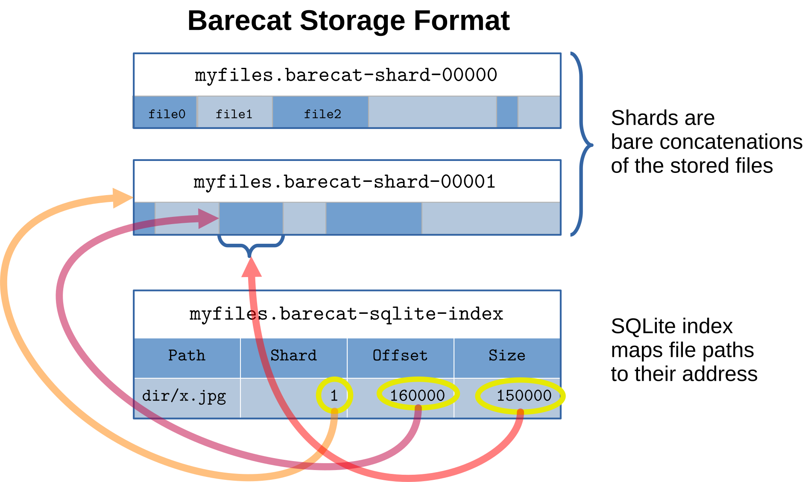

# Barecat

Barecat (**bare** con**cat**enation) is a highly scalable, simple aggregate storage format for
storing many (tens of millions and more) small files, with focus on fast random access and 
minimal overhead.

Barecat can be thought of as a simple filesystem, or as something akin to an indexed tarball, or a
key-value store. Indeed, it can be mounted via FUSE, converted to a tarball, or used like a dictionary
within Python.

Barecat associates strings (file paths) with binary data (file contents). It's like a dictionary,
but it has some special handling for '/' characters in the keys, supporting a filesystem-like
experience (`listdir`, `walk`, `glob`, etc).

Internally, all the data is simply concatenated one after another into one or more data shard files.
Additionally, an index is maintained in an SQLite database, which stores the shard number, the offset
and the size of each inner file (as well as a checksum, and further filesystem-like metadata 
like modification time). Barecat also maintains aggregate statistics for each directory, such as the
total number of files and total file size.




As you can see, the Barecat format is very simple. Readers/writers are easy to write in any language, since
SQLite is a widely-supported format.


## Background

A typical use case for Barecat is storing image files for training deep learning models, where the
files are accessed randomly during training. The files are typically stored on a network file
system, where accessing many small files can be slow, and clusters often put a limit on the number
of files of a user. So it is necessary to somehow merge the small files into big ones.
However, typical archive formats such as tar are not suitable, since they don't allow fast random
lookups. In tar, one has to scan the entire archive as there is no central directory.
Zip is better, but still requires scanning the central directory, which can be slow for very large
archives with millions or tens of millions of files.

We need an index into the archive, and the index itself cannot be required to be loaded
into memory, to support very large datasets.

Therefore, in this format the metadata is indexed separately in an SQLite database for fast lookup
based on paths. The index also allows fast listing of directory contents and contains aggregate
statistics (total file size, number of files) for each directory.

## Features

- **Fast random access**: the archive can be accessed randomly, addressed by filepath,
  without having to scan the entire archive or all the metadata.
  The index is stored in a separate SQLite database file, which itself does not need to be loaded
  entirely into memory.
- **Sharding**: to make it easier to move the data around or to distribute it across multiple
  storage devices, the archive can be split into multiple files of equal size (shards, or volumes). 
  The shards do not have to be concatenated to be used, the library will keep all shard files open
  and load data from the appropriate one during normal operations.
- **Browsability**: The SQLite database contains an index for the parent directories, allowing
  fast listing of directory contents and aggregate statistics (total file size, number of files).
- **Simple storage**: The files are simply concatenated after each other and the index contains
  the offsets and sizes of each file. There is no header format to understand. The index can be
  dumped into any format with simple SQL queries.

## Command line interface

To create a Barecat archive, use the `barecat-create` or `barecat-create-recursive` commands, which 
are automatically installed executables with the pip package.

```bash
barecat-create --file=mydata.barecat --shard-size=100G < path_of_paths.txt 

find dirname -name '*.jpg' -print0 | barecat-create --null --file=mydata.barecat --shard-size=100G

barecat-create-recursive dir1 dir2 dir3 --file=mydata.barecat --shard-size=100G
```

This may yield the following files:

```
mydata.barecat-shard-00001
mydata.barecat-shard-00002
mydata.barecat-sqlite-index
```

The files can be extracted out again. Unix-like permissions, modification times, owner info are
preserved.

```bash
barecat-extract --file=mydata.barecat --target-directory=targetdir/
```

## Python API

```python

import barecat

with barecat.Barecat('mydata.barecat', readonly=False) as bc:
  bc['path/to/file/as/stored.jpg'] = binary_file_data
  bc.add_by_path('path/to/file/on/disk.jpg')
  
  with open('path', 'rb') as f:
    bc.add('path/to/file/on/disk.jpg', fileobj=f)
    
with barecat.Barecat('mydata.barecat') as bc:
  binary_file_data = bc['path/to/file.jpg']
  entrynames = bc.listdir('path/to')
  for root, dirs, files in bc.walk('path/to/something'):
    print(root, dirs, files)
    
  paths = bc.glob('path/to/**/*.jpg', recursive=True)
  
  with bc.open('path/to/file.jpg', 'rb') as f:
    data = f.read(123)
```

## Mounting via FUSE

Barecat archives can be mounted via FUSE, allowing it to be used like a filesystem.
It can handle at least tens of millions of files and terabytes of data, even over 100k files in
single directories. Directory listing is written to produce the results in a streaming fashion,
so entries will start appearing even in huge directories fairly quickly. 

```bash

# readonly:
barecat-mount mydata.barecat mountpoint/

# read-write:
barecat-mount --writable mydata.barecat mountpoint/

# unmount:
fusermount -u mountpoint/
# or
umount mountpoint/
```  

Since Barecat always adds new files at the end of the archive, many deletions and insertions
will lead to fragmentation. The general idea is to write once, read many times, and do
deletions only when you need to fix a mistake. There is basic heuristic auto-defragmentation
that can be enabled as follows:

```bash
barecat-mount --writable --enable-defrag mydata.barecat mountpoint/
```

This way, the filesystem will periodically defragment itself after significant amount of deletions.
You can also perform a defrag with:

```bash
barecat-defrag mydata.barecat
```

This will go in sequence and move all the files towards the beginning of the archive, leaving
no gaps. This may take very long, since even closing one byte gap requires moving all the
following data. A quick option is available with:

```bash
barecat-defrag --quick mydata.barecat
```

This will proceed backwards, starting from the end of the archive, and will move each file
into the first available gap, counted from the beginning of the archive (first-fit). The 
algorithm stops after meeting the first file that has no gap that can fit it.

...documentation to be continued...

## Image viewer

Barecat comes with a simple image viewer that can be used to browse the contents of a Barecat
archive.

```bash
barecat-image-viewer mydata.barecat
```

 
